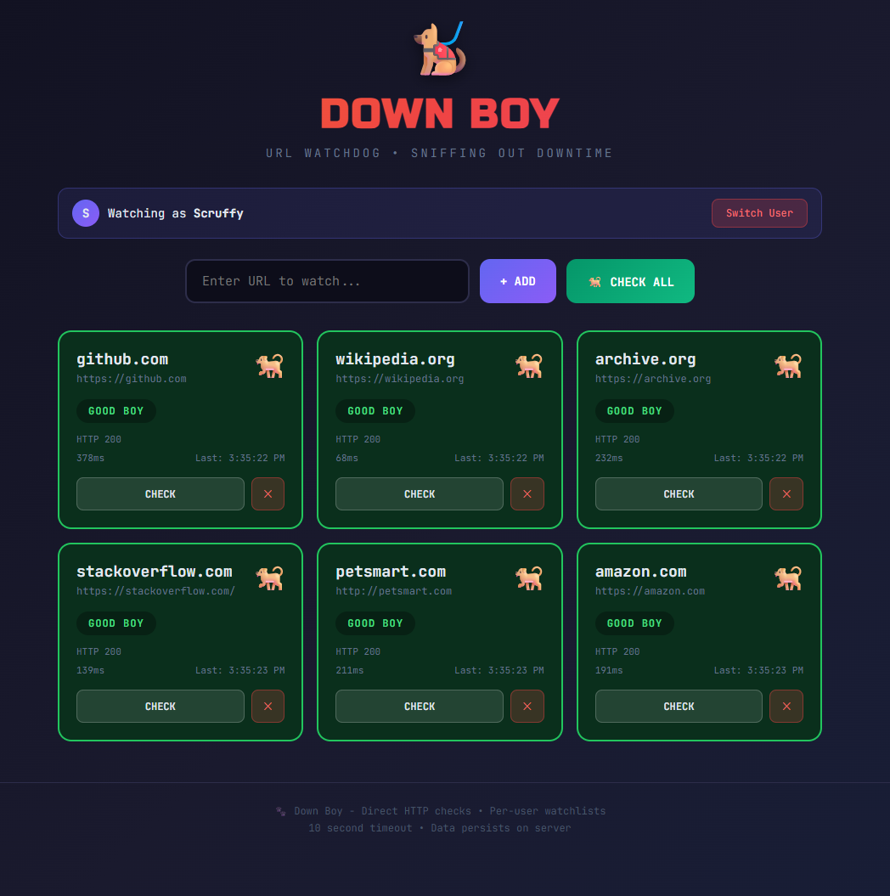

<div align="center">

# 🐕 Down Boy

**A lightweight URL watchdog for monitoring site availability**

[](https://opensource.org/licenses/MIT)
[](https://nodejs.org/)
[](#)

[Features](#features) • [Screenshot](#screenshot) • [Installation](#installation) • [Usage](#usage) • [API](#api-reference) • [Configuration](#configuration) • [Contributing](#contributing)

</div>

---

## About

Down Boy is a simple, self-hosted URL monitoring tool that checks if your sites are responding. Built for IT teams who need a quick way to check on internal services without the overhead of enterprise monitoring solutions.

**Why Down Boy?**
- Zero external dependencies — just Node.js
- Per-user watchlists — team members manage their own sites
- Direct HTTP checks — no CORS proxy issues, works with internal sites
- Persistent storage — survives server restarts
- Self-signed SSL support — works with internal certs

## Features

- ✅ Monitor unlimited URLs
- ✅ Per-user site lists with simple name-based identification  
- ✅ 10-second timeout detection for hanging services
- ✅ Response time tracking
- ✅ HTTP status code visibility
- ✅ JSON file persistence
- ✅ REST API for scripting and automation
- ✅ Works with self-signed SSL certificates

## Screenshot

<div align="center">

</div>

## Installation

### Prerequisites

- [Node.js](https://nodejs.org/) v18 or higher

### Quick Start

```bash
# Clone the repository
git clone https://github.com/username/down-boy.git
cd down-boy

# Start the server
node server.js
```

Open your browser to `http://localhost:3000`

### Running on a Shared Server

Deploy on any server your team can access:

```bash
# On your server
node server.js

# Team members access via:
# http://your-server-ip:3000
```

### Running as a Background Service

```bash
# Using nohup
nohup node server.js > downboy.log 2>&1 &

# Using PM2 (if installed)
pm2 start server.js --name "down-boy"
```

<details>
<summary>📋 Systemd service (Linux)</summary>

Create `/etc/systemd/system/downboy.service`:

```ini
[Unit]
Description=Down Boy URL Monitor
After=network.target

[Service]
Type=simple
User=www-data
WorkingDirectory=/path/to/down-boy
ExecStart=/usr/bin/node server.js
Restart=on-failure

[Install]
WantedBy=multi-user.target
```

Then:

```bash
sudo systemctl enable downboy
sudo systemctl start downboy
```

</details>

## Usage

### Web Interface

1. Open the app in your browser
2. Enter your name when prompted (creates your personal watchlist)
3. Add URLs to monitor
4. Click **CHECK ALL** or check individual sites

### Status Indicators

| Status | Meaning |
|--------|---------|
| 🐕 **GOOD BOY** | Site is responding (HTTP < 400) |
| 🦴 **DOWN!** | Site returned error (HTTP ≥ 400) |
| 💤 **TIMEOUT** | No response within 10 seconds |
| ❌ **ERROR** | Connection failed |

## API Reference

All endpoints (except `/api/check` and `/api/users`) require the `X-User-Id` header.

### Endpoints

#### Check a URL
```bash
curl -X POST http://localhost:3000/api/check \
  -H "Content-Type: application/json" \
  -d '{"url": "https://your-site.com"}'
```

#### Get User's Sites
```bash
curl http://localhost:3000/api/sites \
  -H "X-User-Id: your-username"
```

#### Add a Site
```bash
curl -X POST http://localhost:3000/api/sites \
  -H "Content-Type: application/json" \
  -H "X-User-Id: your-username" \
  -d '{"url": "https://your-site.com", "name": "My Site"}'
```

#### Delete a Site
```bash
curl -X DELETE http://localhost:3000/api/sites/SITE_ID \
  -H "X-User-Id: your-username"
```

#### Check All User's Sites
```bash
curl http://localhost:3000/api/check-all \
  -H "X-User-Id: your-username"
```

#### List All Users
```bash
curl http://localhost:3000/api/users
```

### Response Format

```json
{
  "status": "up",
  "statusCode": 200,
  "responseTime": 234,
  "lastChecked": "2024-01-15T10:30:00.000Z"
}
```

## Configuration

Edit these constants at the top of `server.js`:

| Variable | Default | Description |
|----------|---------|-------------|
| `PORT` | `3000` | HTTP server port |
| `TIMEOUT_MS` | `10000` | Request timeout in milliseconds |
| `DATA_FILE` | `./sites-data.json` | Path to persistent storage |

## Data Storage

Site data is stored in `sites-data.json`:

```json
{
  "users": {
    "username": {
      "sites": [
        {
          "id": 1702847293847,
          "url": "https://your-site.com",
          "name": "My Site"
        }
      ]
    }
  }
}
```

## Roadmap

- [ ] Authentication (optional password protection)
- [ ] Scheduled automatic checks
- [ ] Email/Slack notifications for downtime
- [ ] Response time history graphs
- [ ] Docker container

## Contributing

Contributions are welcome! Feel free to:

1. Fork the repository
2. Create a feature branch (`git checkout -b feature/amazing-feature`)
3. Commit your changes (`git commit -m 'Add amazing feature'`)
4. Push to the branch (`git push origin feature/amazing-feature`)
5. Open a Pull Request

## License

This project is licensed under the MIT License — see the [LICENSE](LICENSE) file for details.

---

<div align="center">

**[⬆ Back to Top](#-down-boy)**

</div>
